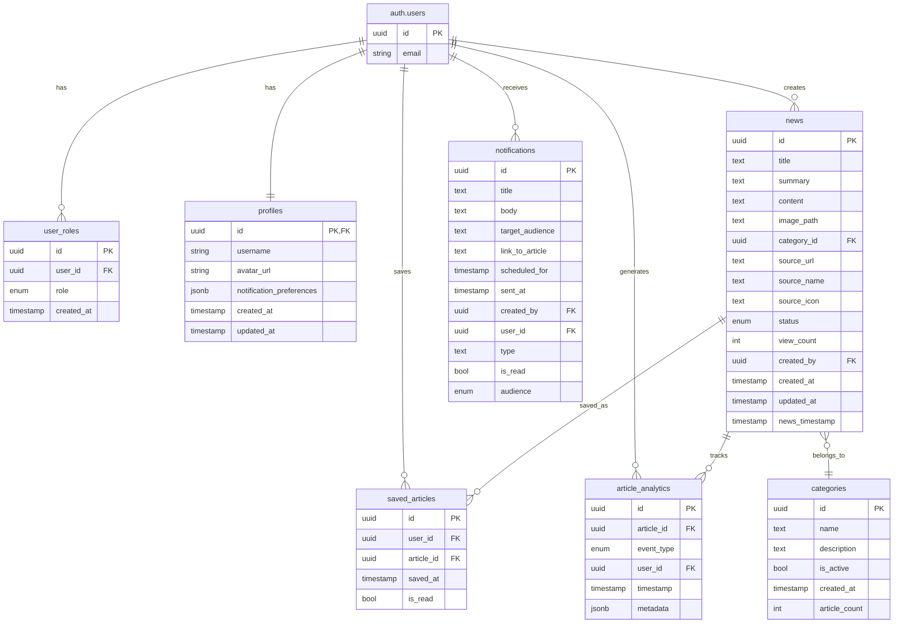
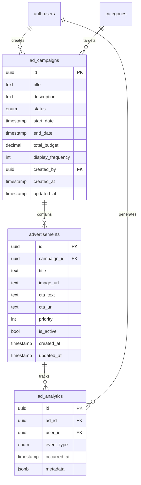

# Database Relationship Diagram
Created: 2025-04-24 15:53

## Current Database Structure

## Proposed Advertisement Structure

## Notes

1. The advertisement structure follows similar patterns to existing tables:
   - UUID primary keys
   - Created/updated timestamps
   - Status tracking
   - Analytics tracking

2. Key relationships:
   - Campaigns contain multiple advertisements
   - Advertisements generate analytics events
   - Users create campaigns
   - Users generate ad analytics events
   - Campaigns can target specific categories

3. Safety features:
   - Similar structure to existing tables enables familiar backup/restore
   - Status fields allow gradual rollout
   - Analytics structure matches existing pattern
